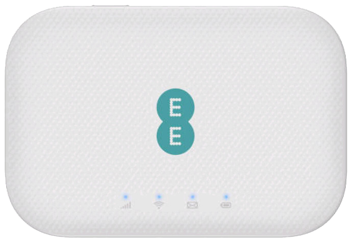

# Alcatel EE71 - Utilities and Tools for Device Management

**[English](README.md) | [Русский](README.ru.md)**

## Table of Contents

- [Device Description](#device-description)
- [Important Recovery Mode Information](#-important-recovery-mode-information)
- [Requirements](#requirements)
- [Tools](#tools)
  - [device_info](#device_info)
  - [enable_adb_python](#enable_adb_python)
  - [backup_via_adb](#backup_via_adb)
  - [dropbear](#dropbear)
- [Support and Contributions](#support-and-contributions)
- [Development Plans](#development-plans)
- [Contacts](#contacts)
- [License](#license)

---

## Device Description

**Model:** Alcatel EE71 (TCL T77W676)  
**Type:** Mobile 4G/LTE Router

### Key Specifications

- **Processor:** Qualcomm MDM9640 (ARM Cortex-A7)
- **Operating System:** Linux 3.10.49 (embedded)
- **Memory:** NAND flash with UBI/UBIFS filesystem
- **Communication Standards:** LTE Cat.7, UMTS/3G, GSM/2G
- **LTE Bands:** B3/B7/B20 (1800/2600/800 MHz)
- **Wi-Fi:** 2.4 GHz (802.11 b/g/n), 5 GHz (802.11 a/b/n/ac)
- **Data Transfer Speed:** up to 300 Mbps (download)
- **Battery:** 2150 mAh
- **Ports:** Micro-USB
- **Dimensions:** 62.5 x 92 x 13.3 mm
- **Weight:** ~85 g

### Device Photo



---

## ⚠️ Important Recovery Mode Information

When working in **recovery mode**, please note the following:

- **Root partition (`/`)**: Points to the **recovery** partition, not the operational system
- **Operational partition**: Mounted at `/system` 
- When adding new tools to the device, place them in `/system`, not in the recovery filesystem root

This is critical when installing utilities, scripts, and configuration files.

---

## Requirements

### For All Tools
- **ADB (Android Debug Bridge)** - must be installed and available in PATH
- USB connection to the device

### For enable_adb_python
- **Python 3.6+**
- **PyUSB** (`pip install pyusb`)
- **libusb** (system library):
  - macOS: `brew install libusb`
  - Linux: usually pre-installed or `apt-get install libusb-1.0-0`
  - Windows: requires separate installation

---

## Tools

### device_info

**Purpose:** Device information and diagnostic data collected from the device.

**Description:**  
Contains device specifications, system information, and diagnostic output collected from the Alcatel EE71 device. This information is useful for understanding device hardware, firmware versions, and system configuration.

**Location:** `device_info/`

**Contents:**
- `device_info.txt` - Complete device information including:
  - CPU specifications (Qualcomm MDM9640, ARMv7)
  - Kernel version (Linux 3.10.49)
  - MTD partition layout
  - USB configuration
  - Network interfaces
  - SoC information
- `dmesg_full.txt` - Full kernel boot messages and system diagnostics

**Usage:**

This folder contains reference information about the device hardware and firmware. It's primarily for documentation and reference purposes, helping developers understand:
- Device partition structure
- Hardware specifications
- System capabilities
- Network interface configuration

**Note:** This information was collected from a working device via ADB. The data may vary slightly between different firmware versions or device batches.

---

### enable_adb_python

**Purpose:** Enable ADB mode on the device via USB Mass Storage interface.

**Description:**  
This tool is a cross-platform replacement for the `TCL_SWITCH_UTILITY.exe` utility for macOS and Linux users. Sends a special SCSI command (CDB) through USB MSC (Mass Storage Class) interface to switch the device to ADB mode.

**Location:** `enable_adb_python/enable_adb.py`

#### Installing Dependencies

```bash
cd enable_adb_python
pip install -r requirements.txt

# Installing system libusb library
# macOS:
brew install libusb

# Linux (Debian/Ubuntu):
sudo apt-get install libusb-1.0-0 libusb-1.0-0-dev

# Linux (RedHat/CentOS):
sudo yum install libusb libusb-devel
```

#### Preparing the Device (Recovery Mode)

Before running the script, the device must be in recovery mode:

1. **Turn off the device** (if powered on)
2. **Remove the battery** (if possible)
3. **Press and hold the RESET button** on the device
4. **While holding RESET**, connect the USB cable to the computer
5. **Then connect the USB cable to the device**
6. Release the RESET button when indicators start blinking
7. A hidden disk (USB Mass Storage device) should appear on the computer

#### Usage

```bash
# List connected USB devices with MSC interface
python3 enable_adb.py --list

# Automatic device detection and command sending (recommended)
python3 enable_adb.py

# Specify device by VID:PID
python3 enable_adb.py --vidpid 1bbb:0908

# Enable debug output
python3 enable_adb.py --verbose

# Manually specify libusb path (if auto-detection fails)
python3 enable_adb.py --libusb-path /opt/homebrew/lib/libusb-1.0.dylib
```

**After successful execution:**
- Check connection: `adb devices`
- Device should appear in the list as `device`

#### Troubleshooting

**macOS:**
- If device is not detected, macOS may block access to MSC interface
- In this case, it's easier to use Linux
- Try running with `sudo` privileges (may help, but not always)

**Linux:**
- If device is not detected, ensure `libusb-1.0-0` is installed
- May require running with `sudo` privileges
- Check for conflicting USB drivers: `lsusb`

**Windows:**
- Requires device driver installation (see documentation)
- Using the original `TCL_SWITCH_UTILITY.exe` may be easier

---

### backup_via_adb

**Purpose:** Create backup copies of device partitions via ADB.

**Description:**  
Script for automatic backup of all critical device partitions (efs2, modem, system, recoveryfs, boot, jrdresource, etc.) using `adb pull`. Supports automatic partition detection via `/proc/mtd` and SHA256 checksum calculation.

**Location:** `backup_via_adb/backup_ee71.sh`

#### Requirements

- ADB must be installed and working
- Device connected via USB
- **Important:** Requires `adb root` - script must run with root privileges

#### Usage

```bash
cd backup_via_adb

# Basic usage (backup all default partitions)
./backup_ee71.sh

# Specify backup directory
BACKUP_DIR=/path/to/backup ./backup_ee71.sh

# Backup only specific partitions
PARTS="efs2 modem system" ./backup_ee71.sh

# Use different mode (if supported)
MODE=pull ./backup_ee71.sh
```

#### Default Partitions

The script creates backups of the following partitions by default:
- `efs2` - configuration and IMEI (critically important!)
- `modem` - modem firmware
- `system` - system files
- `recoveryfs` - recovery partition
- `boot` - bootloader image
- `jrdresource` - manufacturer resources
- `sbl` - Secondary Boot Loader
- `tz` - Trust Zone
- `rpm` - Resource Power Manager
- `aboot` - Application Bootloader

#### Output Files

The script creates a directory `backup/pull-YYYYMMDD-HHMMSS/` with the following files:
- `*.img` - partition images
- `adb_getprop.txt` - output of `adb shell getprop`
- `proc_mtd.txt` - partition information from `/proc/mtd`
- `checksums.sha256` - checksums of all images
- `backup.log` - operation log

#### Example

```bash
# Run backup
cd backup_via_adb
./backup_ee71.sh

# Result will be in: backup/pull-20251020-120000/
```

#### Important Notes

- **Always backup `efs2`** - this partition contains IMEI and critical configuration
- Backup size can be significant (hundreds of MB)
- Ensure sufficient free disk space
- Use appropriate fastboot tools or other flashing methods to restore partitions

---

### dropbear

**Purpose:** Install SSH server (Dropbear) on the device for remote access.

**Description:**  
Installs lightweight Dropbear SSH server on the device, creates necessary symbolic links (`ssh`, `scp`) and configures autostart via init.d scripts.

**⚠️ Important:** Uses old Dropbear version (2014.66). Modern SSH clients may not support some algorithms by default. See section below for compatibility configuration.

**Location:** `dropbear/install.sh`

#### File Structure

```
dropbear/
├── install.sh              # Installation script
└── files/
    ├── dropbearmulti-2014.66  # Dropbear binary
    └── dropbear             # Init.d script for autostart
```

#### Requirements

- ADB connection
- Device must support binary execution in `/system`

#### Usage

```bash
cd dropbear

# Simple installation
./install.sh
```

#### What the Script Does

1. **Checks for files** in `files/` directory
2. **Creates necessary directories** on device:
   - `/system/etc/init.d/`
   - `/system/etc/rc5.d/`
   - `/system/usr/bin/`
   - `/system/usr/sbin/`
3. **Copies binary file** to `/system/usr/sbin/dropbearmulti`
4. **Creates symbolic links:**
   - `/system/usr/sbin/dropbear` → `dropbearmulti`
   - `/system/usr/sbin/dropbearkey` → `dropbearmulti`
   - `/system/usr/sbin/dropbearconvert` → `dropbearmulti`
   - `/system/usr/bin/ssh` → `/usr/sbin/dropbearmulti`
   - `/system/usr/bin/scp` → `/usr/sbin/dropbearmulti`
5. **Installs init.d script** for autostart
6. **Creates startup link** in `/system/etc/rc5.d/S10dropbear`
7. **Sets root password:** `oemlinux1`
8. **Copies SSH public key** from `~/.ssh/` (if found)

#### Connecting via SSH

After installation and device reboot:

```bash
# SSH connection
ssh root@<device-IP-address>
# Password: oemlinux1
```

#### Parameters

- **Default root password:** `oemlinux1` (can be changed after installation)
- **SSH keys:** Script automatically searches for public keys in `~/.ssh/`:
  - `id_rsa.pub`
  - `id_ed25519.pub`
  - `id_ecdsa.pub`
  - `id_dsa.pub`

#### Modern SSH Client Support

The old Dropbear version (2014.66) uses outdated encryption algorithms. To connect from modern SSH clients (OpenSSH 8.0+), you need to enable RSA encryption and other legacy algorithm support.

**OpenSSH Client Configuration:**

Connect directly with algorithm specification:

```bash
ssh -o "PubkeyAcceptedKeyTypes +ssh-rsa" \
    -o "HostkeyAlgorithms +ssh-rsa" \
    root@<device-IP-address>
```

#### Important Notes

- ⚠️ **Working in recovery mode:** When installing in recovery mode, remember that root `/` points to recovery, and `/system` is the operational partition
- Installation happens in `/system`, which is correct
- After installation, reboot the device: `adb reboot`
- After reboot, SSH server should start automatically
- To verify: `adb shell "ps | grep dropbear"`

#### Troubleshooting

**SSH not starting:**
```bash
# Check for process
adb shell "ps | grep dropbear"

# Manual start
adb shell "/usr/sbin/dropbear -E -F"
```

---

## Development Plans

The following improvements and new features are planned:

- **Update Dropbear to latest version** — Compile and install modern Dropbear version with support for new encryption algorithms and improved security
- **Add AT command sending capability** — Utility for sending AT commands to the modem via ADB or SSH
- **Enable 256QAM and aggregation up to CAT-12** — Tools for activating extended modem capabilities (256QAM, carrier aggregation, LTE category increase)
- **TTL fix and IMEI change** — Utilities for bypassing operator restrictions (TTL fix) and changing device identifier
- **Add Entware support** — Install and configure Entware package manager to extend device functionality
- **Docker image for tool compilation** — Create Docker image with cross-compilation for ARM platform (Qualcomm MDM9640) to simplify tool builds

---

## Support and Contributions

If you encounter issues or have suggestions for improvement, please create Issues in the repository.

**Pull Requests are welcome!** We appreciate your contribution to the project. If you want to add new functionality, fix bugs, or improve documentation — create a Pull Request.

**Warning:** Using these tools may damage your device. Use at your own risk. Always backup critical partitions before making changes.

---

## Contacts

For questions and suggestions: **rctphone@gmail.com**

---

## License

See [LICENSE](LICENSE) file
