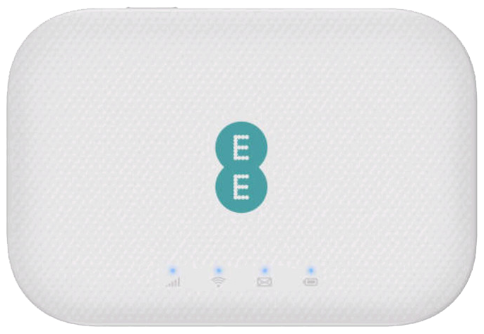

# Alcatel EE71 - Утилиты и инструменты для работы с устройством

**[English](README.md) | [Русский](README.ru.md)**

## Содержание

- [Описание устройства](#описание-устройства)
- [Важная информация о режиме Recovery](#-важная-информация-о-режиме-recovery)
- [Требования](#требования)
- [Инструменты](#инструменты)
  - [device_info](#device_info)
  - [enable_adb_python](#enable_adb_python)
  - [backup_via_adb](#backup_via_adb)
  - [dropbear](#dropbear)
- [Поддержка и вклад](#поддержка-и-вклад)
- [Планы развития](#планы-развития)
- [Контакты](#контакты)
- [Лицензия](#лицензия)

---

## Описание устройства

**Модель:** Alcatel EE71 (TCL T77W676)  
**Тип:** Мобильный 4G/LTE роутер

### Основные характеристики

- **Процессор:** Qualcomm MDM9640 (ARM Cortex-A7)
- **Операционная система:** Linux 3.10.49 (встроенная)
- **Память:** NAND flash с UBI/UBIFS файловой системой
- **Стандарты связи:** LTE Cat.7, UMTS/3G, GSM/2G
- **Диапазоны LTE:** B3/B7/B20 (1800/2600/800 МГц)
- **Wi-Fi:** 2.4 ГГц (802.11 b/g/n), 5 ГГц (802.11 a/b/n/ac)
- **Скорость передачи:** до 300 Мбит/с (загрузка)
- **Аккумулятор:** 2150 мАч
- **Порты:** Micro-USB
- **Габариты:** 62.5 x 92 x 13.3 мм
- **Вес:** ~85 г

### Фото устройства



---

## ⚠️ Важная информация о режиме Recovery

При работе в **recovery mode** следует учитывать следующее:

- **Корневой раздел (`/`)**: Ссылается на раздел **recovery**, а не на операционную систему
- **Операционный раздел**: Монтируется в `/system` 
- При добавлении новых инструментов на устройство размещайте их в `/system`, а не в корне файловой системы recovery

Это критично при установке утилит, скриптов и конфигурационных файлов.

---

## Требования

### Для всех инструментов
- **ADB (Android Debug Bridge)** - должен быть установлен и доступен в PATH
- Подключение устройства через USB

### Для enable_adb_python
- **Python 3.6+**
- **PyUSB** (`pip install pyusb`)
- **libusb** (системная библиотека):
  - macOS: `brew install libusb`
  - Linux: обычно установлен по умолчанию или `apt-get install libusb-1.0-0`
  - Windows: требуется установка отдельно

---

## Инструменты

### device_info

**Назначение:** Информация об устройстве и диагностические данные, собранные с устройства.

**Описание:**  
Содержит характеристики устройства, системную информацию и диагностический вывод, собранные с устройства Alcatel EE71. Эта информация полезна для понимания аппаратного обеспечения устройства, версий прошивки и конфигурации системы.

**Расположение:** `device_info/`

**Содержимое:**
- `device_info.txt` - Полная информация об устройстве, включая:
  - Характеристики CPU (Qualcomm MDM9640, ARMv7)
  - Версию ядра (Linux 3.10.49)
  - Структуру разделов MTD
  - Конфигурацию USB
  - Сетевые интерфейсы
  - Информацию о SoC
- `dmesg_full.txt` - Полные сообщения загрузки ядра и системная диагностика

**Использование:**

Эта папка содержит справочную информацию об аппаратном обеспечении устройства и прошивке. В основном предназначена для документации и справки, помогает разработчикам понять:
- Структуру разделов устройства
- Характеристики аппаратного обеспечения
- Возможности системы
- Конфигурацию сетевых интерфейсов

**Примечание:** Эта информация была собрана с рабочего устройства через ADB. Данные могут немного отличаться между различными версиями прошивки или партиями устройств.

---

### enable_adb_python

**Назначение:** Включение режима ADB на устройстве через USB Mass Storage интерфейс.

**Описание:**  
Этот инструмент является кроссплатформенной заменой утилиты `TCL_SWITCH_UTILITY.exe` для пользователей macOS и Linux. Отправляет специальную SCSI команду (CDB) через USB MSC (Mass Storage Class) интерфейс для переключения устройства в режим ADB.

**Расположение:** `enable_adb_python/enable_adb.py`

#### Установка зависимостей

```bash
cd enable_adb_python
pip install -r requirements.txt

# Установка системной библиотеки libusb
# macOS:
brew install libusb

# Linux (Debian/Ubuntu):
sudo apt-get install libusb-1.0-0 libusb-1.0-0-dev

# Linux (RedHat/CentOS):
sudo yum install libusb libusb-devel
```

#### Подготовка устройства (Recovery Mode)

Перед запуском скрипта устройство должно быть в режиме recovery:

1. **Выключите устройство** (если включено)
2. **Извлеките аккумулятор** (если возможно)
3. **Зажмите кнопку RESET** на устройстве
4. **Удерживая RESET**, подключите USB кабель к компьютеру
5. **Затем подключите USB кабель к устройству**
6. Отпустите кнопку RESET, когда индикаторы начнут мигать
7. На компьютере должен появиться скрытый диск (USB Mass Storage устройство)

#### Использование

```bash
# Список подключенных USB устройств с MSC интерфейсом
python3 enable_adb.py --list

# Автоматическое определение устройства и отправка команды (рекомендуется)
python3 enable_adb.py

# Указание конкретного устройства по VID:PID
python3 enable_adb.py --vidpid 1bbb:0908

# Включение отладочного вывода
python3 enable_adb.py --verbose

# Указание пути к libusb вручную (если автоматическое определение не работает)
python3 enable_adb.py --libusb-path /opt/homebrew/lib/libusb-1.0.dylib
```

**После успешного выполнения:**
- Проверьте подключение: `adb devices`
- Устройство должно появиться в списке как `device`

#### Устранение проблем

**macOS:**
- Если устройство не определяется, macOS может блокировать доступ к MSC интерфейсу
- В этом случае проще использовать Linux
- Попробуйте запуск с правами `sudo` (может помочь, но не всегда)

**Linux:**
- Если устройство не определяется, убедитесь, что установлен `libusb-1.0-0`
- Может потребоваться запуск с правами `sudo`
- Проверьте, что нет конфликтующих USB драйверов: `lsusb`

**Windows:**
- Требуется установка драйверов устройства (см. документацию)
- Использование оригинальной `TCL_SWITCH_UTILITY.exe` может быть проще

---

### backup_via_adb

**Назначение:** Создание резервных копий разделов устройства через ADB.

**Описание:**  
Скрипт для автоматического создания бэкапов всех критических разделов устройства (efs2, modem, system, recoveryfs, boot, jrdresource и др.) с использованием `adb pull`. Поддерживает автоматическое определение разделов через `/proc/mtd` и вычисление контрольных сумм SHA256.

**Расположение:** `backup_via_adb/backup_ee71.sh`

#### Требования

- ADB должен быть установлен и работать
- Устройство подключено через USB
- **Важно:** Требуется `adb root` - скрипт должен работать с правами root

#### Использование

```bash
cd backup_via_adb

# Базовое использование (бэкап всех разделов по умолчанию)
./backup_ee71.sh

# Указание конкретной директории для сохранения
BACKUP_DIR=/path/to/backup ./backup_ee71.sh

# Бэкап только определенных разделов
PARTS="efs2 modem system" ./backup_ee71.sh

# Использование другого режима (если поддерживается)
MODE=pull ./backup_ee71.sh
```

#### Разделы по умолчанию

Скрипт по умолчанию создает бэкапы следующих разделов:
- `efs2` - конфигурация и IMEI (критически важно!)
- `modem` - прошивка модема
- `system` - системные файлы
- `recoveryfs` - раздел восстановления
- `boot` - образ загрузчика
- `jrdresource` - ресурсы производителя
- `sbl` - Secondary Boot Loader
- `tz` - Trust Zone
- `rpm` - Resource Power Manager
- `aboot` - Application Bootloader

#### Выходные файлы

Скрипт создает директорию `backup/pull-YYYYMMDD-HHMMSS/` со следующими файлами:
- `*.img` - образы разделов
- `adb_getprop.txt` - вывод `adb shell getprop`
- `proc_mtd.txt` - информация о разделах из `/proc/mtd`
- `checksums.sha256` - контрольные суммы всех образов
- `backup.log` - лог выполнения операций

#### Пример

```bash
# Запуск бэкапа
cd backup_via_adb
./backup_ee71.sh

# Результат будет в: backup/pull-20251020-120000/
```

#### Важные замечания

- **Всегда делайте бэкап `efs2`** - этот раздел содержит IMEI и критическую конфигурацию
- Размер бэкапа может быть значительным (сотни МБ)
- Убедитесь в наличии свободного места на диске
- Для восстановления разделов используйте соответствующие инструменты fastboot или другие методы прошивки

---

### dropbear

**Назначение:** Установка SSH сервера (Dropbear) на устройство для удаленного доступа.

**Описание:**  
Устанавливает облегченный SSH сервер Dropbear на устройство, создает необходимые символические ссылки (`ssh`, `scp`) и настраивает автозапуск через init.d скрипты.

**⚠️ Важно:** Используется старая версия Dropbear (2014.66). Современные SSH клиенты могут не поддерживать некоторые алгоритмы по умолчанию. См. раздел ниже для настройки совместимости.

**Расположение:** `dropbear/install.sh`

#### Структура файлов

```
dropbear/
├── install.sh              # Скрипт установки
└── files/
    ├── dropbearmulti-2014.66  # Бинарный файл dropbear
    └── dropbear             # Init.d скрипт для автозапуска
```

#### Требования

- ADB подключение
- Устройство должно поддерживать выполнение бинарных файлов в `/system`

#### Использование

```bash
cd dropbear

# Простая установка
./install.sh
```

#### Что делает скрипт

1. **Проверяет наличие файлов** в директории `files/`
2. **Создает необходимые директории** на устройстве:
   - `/system/etc/init.d/`
   - `/system/etc/rc5.d/`
   - `/system/usr/bin/`
   - `/system/usr/sbin/`
3. **Копирует бинарный файл** в `/system/usr/sbin/dropbearmulti`
4. **Создает символические ссылки:**
   - `/system/usr/sbin/dropbear` → `dropbearmulti`
   - `/system/usr/sbin/dropbearkey` → `dropbearmulti`
   - `/system/usr/sbin/dropbearconvert` → `dropbearmulti`
   - `/system/usr/bin/ssh` → `/usr/sbin/dropbearmulti`
   - `/system/usr/bin/scp` → `/usr/sbin/dropbearmulti`
5. **Устанавливает init.d скрипт** для автозапуска
6. **Создает ссылку запуска** в `/system/etc/rc5.d/S10dropbear`
7. **Устанавливает пароль root:** `oemlinux1`
8. **Копирует SSH публичный ключ** из `~/.ssh/` (если обнаружен)

#### Подключение через SSH

После установки и перезагрузки устройства:

```bash
# Подключение по SSH
ssh root@<IP-адрес-устройства>
# Пароль: oemlinux1
```

#### Параметры

- **Пароль root по умолчанию:** `oemlinux1` (можно изменить после установки)
- **SSH ключи:** Скрипт автоматически ищет публичные ключи в `~/.ssh/`:
  - `id_rsa.pub`
  - `id_ed25519.pub`
  - `id_ecdsa.pub`
  - `id_dsa.pub`

#### Поддержка современных SSH клиентов

Старая версия Dropbear (2014.66) использует устаревшие алгоритмы шифрования. Для подключения с современных SSH клиентов (OpenSSH 8.0+) необходимо включить поддержку RSA шифрования и других устаревших алгоритмов.

**Настройка SSH клиента (OpenSSH):**

Подключитесь напрямую с указанием алгоритмов:

```bash
ssh -o "PubkeyAcceptedKeyTypes +ssh-rsa" \
    -o "HostkeyAlgorithms +ssh-rsa" \
    root@<IP-адрес-устройства>
```

#### Важные замечания

- ⚠️ **Работа в recovery mode:** При установке в recovery mode помните, что корень `/` указывает на recovery, а `/system` - это операционный раздел
- Установка происходит в `/system`, что правильно
- После установки рекомендуется перезагрузить устройство: `adb reboot`
- После перезагрузки SSH сервер должен автоматически запуститься
- Для проверки: `adb shell "ps | grep dropbear"`

#### Устранение проблем

**SSH не запускается:**
```bash
# Проверка наличия процесса
adb shell "ps | grep dropbear"

# Ручной запуск
adb shell "/usr/sbin/dropbear -E -F"
```

---

## Планы развития

В планах проекта следующие улучшения и новые функции:

- **Обновление Dropbear до актуальной версии** — Компиляция и установка современной версии Dropbear с поддержкой новых алгоритмов шифрования и улучшенной безопасностью
- **Добавление возможности отправки AT команд** — Утилита для отправки AT команд модему через ADB или SSH
- **Включение 256QAM и агрегации до CAT-12** — Инструменты для активации расширенных возможностей модема (256QAM, агрегация каналов, увеличение категории LTE)
- **Фиксация TTL и смена IMEI** — Утилиты для обхода ограничений операторов (TTL fix) и изменения идентификатора устройства
- **Добавление поддержки Entware** — Установка и настройка менеджера пакетов Entware для расширения функциональности устройства
- **Docker образ для компиляции инструментов** — Создание Docker образа с кросскомпиляцией для платформы ARM (Qualcomm MDM9640) для упрощения сборки инструментов

---

## Поддержка и вклад

При обнаружении проблем или предложениях по улучшению, пожалуйста, создавайте Issues в репозитории.

**Pull Requests приветствуются!** Мы будем рады вашему вкладу в развитие проекта. Если вы хотите добавить новый функционал, исправить ошибки или улучшить документацию — создавайте Pull Request.

**Внимание:** Использование этих инструментов может привести к повреждению устройства. Используйте на свой риск. Всегда делайте резервные копии критических разделов перед внесением изменений.

---

## Контакты

По вопросам и предложениям: **rctphone@gmail.com**

---

## Лицензия

См. файл [LICENSE](LICENSE)

